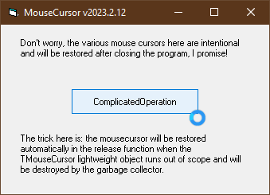

# LwO_MouseCursor  
## lightweight objects, mouse cursor hour glass  

 

Project started around summer 2006.  
COM manages the lifecycle of an object with the reference counting mechanism. Therefore every class in COM has to implement minimum the IUnknown interface.  
The IUnknown interface has these 3 functions in this order:  
* QueryInterface()  
* AddRef()  
* Release()  
  
VB6/VBC/VBA is a perfect member of COM. So every VB-class implements the IUnknown interface.  
But moreover in VB every class also implements the IDispatch interface which again has 4 additional functions that allow the functions of an object to be called by name and in late binding.  
The IDispatch interface has these 4 functions in this order:  
* GetIDsOfNames  
* GetTypeInfo  
* GetTypeInfoCount  
* Invoke  
  
VB can of course deal with classes that implement the IUnknown interface only, the so called lightweight objects.  
This repo is a small example for explaining how to build a lightweight object, and how to use and run it in VB. 
As an example the object created here will 
The lightweight object technic was first published by Matthew Curland in 1999  
Have a look at the book:  

[http://powervb.mvps.org/](http://powervb.mvps.org/)  

